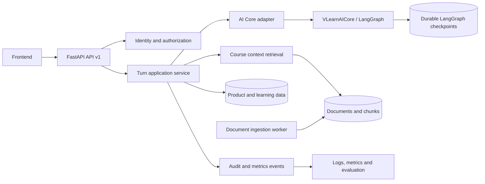

# Kế hoạch xây dựng Backend VLearn theo phase

> Trạng thái: kế hoạch triển khai dựa trên code hiện có ngày 30/07/2026  
> Phạm vi đã khảo sát: toàn bộ `ai_core/`, `backend/`, contract trong `frontend/API_DOCUMENTATION.md` và các điểm gọi API trong `frontend/app.js`

## Trạng thái triển khai

- [x] Phase 0 — Khóa contract và xử lý rủi ro P0.
- [x] Phase 1 — Backend MVP vertical slice.
- [ ] Phase 2 — Persistence và resume bền vững.
- [ ] Phase 3 — Document ingestion, retrieval và citation.
- [ ] Phase 4 — Quality, security và observability.
- [ ] Phase 5 — Deploy và mở rộng sau MVP.

Phase 1 hiện dùng process-local memory repository và LangGraph `MemorySaver`;
đây là giới hạn có chủ đích cho tới khi triển khai PostgreSQL/checkpointer ở
Phase 2.

## 1. Mục tiêu

Xây dựng backend đủ ổn định để nối frontend hiện tại với `ai_core`, duy trì được Learning Loop qua nhiều request, trả lời có căn cứ từ tài liệu, ghi nhận learning signals và có thể triển khai trên môi trường nhiều process mà không mất state.

Kết quả tối thiểu của MVP:

- Frontend chạy được trọn 4 route: `simple`, `clarify`, `check`, `deep`.
- Luồng `start -> interrupt -> resume -> complete` không mất state khi restart backend.
- Không gửi đáp án quiz, API key hoặc trace nội bộ xuống client.
- Mọi câu trả lời grounded đều truy ngược được tới document/page/chunk.
- Có log cho route, check result, misconception, latency, token/cost và lỗi.
- Có contract test giữa frontend, backend và public interface của `ai_core`.

## 2. Kết luận sau khi đọc `ai_core`

### 2.1. Phần có thể tái sử dụng trực tiếp

`ai_core` đã có domain model và workflow tương đối hoàn chỉnh:

- Public facade: `VLearnAICore.start_turn(...)` và `VLearnAICore.resume_turn(...)`.
- LangGraph state machine với 4 route:
  - `simple`: trả lời trực tiếp rồi kết thúc.
  - `clarify`: tạo câu hỏi làm rõ, interrupt, nhận câu trả lời rồi tiếp tục.
  - `check`: giải thích, tạo micro-check, interrupt, đánh giá và sửa hiểu nhầm.
  - `deep`: giải thích chuyên sâu rồi gợi ý follow-up.
- Sáu pedagogical tools:
  - `review_concept`
  - `give_direct_answer`
  - `give_example`
  - `motivate`
  - `give_hint`
  - `validate_understanding`
- Pydantic schemas cho route, citation, grounded answer, micro-check, check evaluation, repair plan, follow-up và public result.
- Guardrails cho input, context, grounding và output.
- Bộ test offline dùng deterministic fake model, bao phủ router, tools, injection, clarification, misconception và flow interrupt/resume.

Backend không nên viết lại các quyết định sư phạm này. Backend chỉ nên gọi public facade của `ai_core` qua một adapter/service rõ ràng.

### 2.2. Các khoảng trống phải xử lý ở backend hoặc trước khi production

| Mức | Khoảng trống hiện tại | Ảnh hưởng |
|---|---|---|
| P0 | `VLearnAICore` mặc định dùng `MemorySaver`; `ACTIVE_THREADS` và `QUIZ_SESSIONS` là biến global trong RAM | Mất phiên khi restart, không chạy đúng với nhiều worker/instance |
| P0 | Request cho phép client gửi `api_key` rồi backend thay đổi `OPENAI_API_KEY` global | Có race condition và nguy cơ dùng nhầm key giữa người dùng |
| P0 | Response quiz hiện có `correct_index`; request còn nhận `correct_option`/`expected_keywords` từ client | Lộ đáp án và không thể tin cậy việc chấm ở server |
| P0 | Frontend cần `clarifying_question` và `suggested_inputs`, trong khi adapter hiện trả `question` và `options` | Nhánh clarification có thể lỗi render |
| P0 | SSE trong `backend/main.py` dùng `json.dumps` nhưng chưa import `json`; progress events hiện được dựng giả | Streaming có thể lỗi runtime và telemetry không phản ánh graph thật |
| P0 | Backend public trực tiếp `tool_trace` và trả chi tiết exception | Lộ implementation/model/prompt metadata, khó kiểm soát thông tin nội bộ |
| P0 | CORS đang là `*` cùng `allow_credentials=True` | Không phù hợp khi triển khai có session/auth |
| P1 | `context_guard` phát hiện injection trong context nhưng mới gắn cờ, chưa block/loại đoạn độc hại | Tài liệu có prompt injection vẫn đi vào LLM |
| P1 | `plan_guard.validate_plan_tools()` và `AI_MAX_TOOL_STEPS` chưa được nối vào repair workflow | LLM plan chưa được enforce bằng allowlist tại runtime |
| P1 | `conversation_history` được nhận và lưu trong state nhưng các node chưa sử dụng | Client gửi lịch sử nhưng chưa tạo tác dụng thực tế |
| P1 | `give_example` được nối vào answer nhưng citation/grounding guard chỉ kiểm chứng citations của phần answer gốc | Phần ví dụ có thể vượt ngoài context mà vẫn pass grounding |
| P1 | Context hiện là text của một slide cộng phần bôi đen, chưa có ingestion/chunk/retrieval | Không trả lời tốt câu hỏi cần nhiều slide; citation chưa có ID bền vững |
| P1 | State sau nhánh misconception có thể reset `check_result` trước khi endpoint đọc lại | API khó trả chính xác misconception/attempt vừa xảy ra |
| P1 | `thread_id` có thể do client cấp và chưa gắn với user/conversation | Có nguy cơ collision hoặc truy cập nhầm state |
| P2 | `backend/main.py` đang là module nguyên khối, tự sửa `sys.path`, load PDF lúc import | Khó test, khó thay storage/model và startup chậm |
| P2 | Frontend API documentation còn mô tả Gemini/fallback cũ trong khi backend mới gọi OpenAI qua `ai_core` | Contract và hướng dẫn vận hành không còn đồng nhất |
| P2 | Chưa có backend test, migration, auth, rate limit, idempotency, metrics hoặc deployment manifest | Chưa đủ điều kiện chạy staging/production |

## 3. Nguyên tắc kiến trúc

1. **`ai_core` là domain engine, không phải web layer.** Không đưa `Request`, `HTTPException`, DB ORM hoặc frontend DTO vào `ai_core`.
2. **Backend sở hữu identity và state.** Client không tự chọn state key cuối cùng; backend ánh xạ `conversation_id`/`turn_id` sang LangGraph `thread_id`.
3. **Server là nguồn sự thật của quiz.** Đáp án, expected answer, misconception plan và checkpoint chỉ tồn tại phía server.
4. **Contract public khác trace nội bộ.** Client chỉ nhận progress an toàn và action cần render; trace chi tiết đi vào observability store.
5. **Grounding bắt đầu từ source ID.** Citation phải tham chiếu `document_id`, `page_number`, `chunk_id`, không suy đoán page từ text bằng regex.
6. **Interactive request chạy đồng bộ/streaming; ingestion chạy nền.** Không đưa toàn bộ Learning Loop vào queue vì clarification/check cần phản hồi tức thời.
7. **Mỗi phase có thể demo và rollback độc lập.** Giữ compatibility adapter cho frontend hiện tại trong lúc chuyển sang `/api/v1`.

## 4. Kiến trúc đích



### Trách nhiệm từng lớp

| Lớp | Trách nhiệm |
|---|---|
| API/transport | Validation, HTTP/SSE, error envelope, request ID, compatibility endpoints |
| Application service | Start/resume turn, idempotency, transaction, ownership check, mapping action |
| AI Core adapter | Chuyển domain input/output giữa backend và `VLearnAICore`; không chứa business rule sư phạm mới |
| Retrieval | Chọn context theo course/deck/page/selection/query, áp giới hạn context, trả source metadata |
| Persistence | Conversation, message, turn, action, attempt, citation, event và durable checkpoint |
| Security | Auth, authorization, secret management, input limits, CORS, rate limit, data retention |
| Observability | Structured log, metrics, token/cost, latency theo node, correlation ID |

## 5. Contract backend mục tiêu

### 5.1. Resource và endpoint chính

Giữ các endpoint cũ trong thời gian chuyển đổi, nhưng implement logic mới dưới `/api/v1`.

| Method | Endpoint | Mục đích |
|---|---|---|
| `GET` | `/api/v1/health/live` | Process còn sống |
| `GET` | `/api/v1/health/ready` | DB, checkpointer, model config và document store sẵn sàng |
| `GET` | `/api/v1/decks` | Danh sách bộ slide |
| `GET` | `/api/v1/decks/{deck_id}/pages` | Metadata các trang |
| `GET` | `/api/v1/pages/{page_id}/render` | Render slide có cache |
| `POST` | `/api/v1/conversations` | Tạo conversation và server-owned AI thread |
| `GET` | `/api/v1/conversations/{conversation_id}` | Khôi phục lịch sử và action đang chờ |
| `POST` | `/api/v1/conversations/{conversation_id}/turns` | Bắt đầu một lượt hỏi mới |
| `POST` | `/api/v1/turns/{turn_id}/responses` | Resume clarification/check đang chờ |
| `GET` | `/api/v1/turns/{turn_id}/events` | SSE progress/result nếu tách stream khỏi lệnh tạo turn |

Compatibility endpoints trong giai đoạn MVP:

- `GET /api/slides`
- `GET /api/slides/{page_number}/render`
- `POST /api/tutor/ask`
- `POST /api/tutor/ask/stream`
- `POST /api/clarification/submit`
- `POST /api/quiz/submit`

Các endpoint cũ chỉ map DTO, không giữ một state machine thứ hai.

### 5.2. Response chung cho một turn

```json
{
  "request_id": "req_...",
  "conversation_id": "conv_...",
  "turn_id": "turn_...",
  "status": "awaiting_response",
  "message": {
    "role": "assistant",
    "content": "..."
  },
  "route": {
    "name": "check",
    "confidence": 0.91
  },
  "action": {
    "type": "multiple_choice",
    "action_id": "action_...",
    "question": "...",
    "options": [
      {"id": "opt_a", "text": "..."}
    ]
  },
  "citations": [
    {
      "document_id": "doc_...",
      "page_number": 4,
      "chunk_id": "chunk_...",
      "snippet": "..."
    }
  ],
  "suggestions": []
}
```

Quy tắc:

- `action.type`: `none`, `clarification`, `multiple_choice`, `short_answer`.
- Không trả `correct_option_id`, `expected_answer`, `explanation` trước khi học viên nộp đáp án.
- `action_id` là opaque ID do server tạo; client không gửi lại nội dung đáp án đúng.
- `tool_trace`, prompt version, raw model output và exception stack không có trong production response.
- `status` public nên ổn định: `processing`, `awaiting_response`, `completed`, `blocked`, `failed`.

### 5.3. Resume action

```json
{
  "action_id": "action_...",
  "value": "opt_b",
  "idempotency_key": "client-generated-uuid"
}
```

Backend kiểm tra:

- action thuộc đúng user/conversation;
- action vẫn đang mở;
- loại value hợp lệ;
- idempotency key chưa xử lý;
- checkpoint đang ở đúng interrupt;
- một turn chỉ được resume tuần tự, có row/advisory lock để tránh double submit.

### 5.4. SSE envelope

Chỉ dùng ba nhóm event:

```text
event: progress
data: {"request_id":"...","stage":"routing","message":"Đang chọn cách hỗ trợ phù hợp"}

event: result
data: {"request_id":"...","turn":{...}}

event: error
data: {"request_id":"...","error":{"code":"AI_PROVIDER_UNAVAILABLE","message":"Tạm thời chưa thể xử lý"}}
```

Không phát trace giả. Nếu `ai_core` chưa cung cấp node events, phase MVP chỉ phát các stage backend biết chắc: `accepted`, `retrieving_context`, `running_learning_loop`, `persisting_result`.

## 6. Mô hình dữ liệu đề xuất

### Bảng MVP

| Bảng | Trường chính | Mục đích |
|---|---|---|
| `conversations` | `id`, `user_id`, `course_id`, `ai_thread_id`, `status`, timestamps | Sở hữu phiên chat và ánh xạ LangGraph thread |
| `turns` | `id`, `conversation_id`, `user_query`, `route`, `status`, `retry_count`, timestamps | Một Learning Loop |
| `messages` | `id`, `conversation_id`, `turn_id`, `role`, `content`, `sequence_no` | Lịch sử hiển thị |
| `pending_actions` | `id`, `turn_id`, `type`, `public_payload`, `private_payload`, `status`, expiry | Clarification/check đang chờ |
| `check_attempts` | `id`, `action_id`, `answer`, `is_correct`, `score`, `misconception_code` | Learning signals |
| `citations` | `id`, `turn_id`, `document_id`, `page_number`, `chunk_id`, `snippet` | Grounding có thể audit |
| `interaction_events` | `id`, `turn_id`, `event_type`, `safe_payload`, timestamp | Analytics và evaluation |
| `idempotency_keys` | `user_id`, `key`, `request_hash`, `response_ref`, expiry | Chống gửi lặp |

### Bảng document/retrieval

| Bảng | Trường chính | Mục đích |
|---|---|---|
| `courses` | `id`, `name`, `status` | Phạm vi dữ liệu |
| `documents` | `id`, `course_id`, `name`, `checksum`, `version`, `status` | File nguồn và version |
| `document_pages` | `id`, `document_id`, `page_number`, `text`, `render_uri` | Nội dung theo trang |
| `document_chunks` | `id`, `page_id`, `chunk_index`, `text`, `token_count`, `embedding` | Retrieval và citation |
| `ingestion_jobs` | `id`, `document_id`, `status`, `error_code`, timestamps | Theo dõi pipeline ingest |

LangGraph checkpoints nên dùng PostgreSQL-compatible checkpointer riêng, cùng `ai_thread_id` nhưng không trộn raw checkpoint vào product tables.

## 7. Roadmap theo phase

### Tổng quan

| Phase | Thời lượng gợi ý | Kết quả |
|---|---:|---|
| Phase 0 — Khóa contract và xử lý P0 | 0.5–1 ngày | Prototype không lộ secret/đáp án, frontend và backend nói cùng schema |
| Phase 1 — Backend MVP vertical slice | 1–2 ngày | API v1 + compatibility adapter chạy đủ 4 route bằng state tạm thời |
| Phase 2 — Persistence và resume bền vững | 1.5–2 ngày | PostgreSQL + durable checkpoint + idempotency + khôi phục session |
| Phase 3 — Document ingestion và retrieval | 1.5–2.5 ngày | Context nhiều slide, citation có source ID, ingestion có version |
| Phase 4 — Quality, security và observability | 1.5–2 ngày | Test/eval gates, metrics, rate limit, error handling và audit |
| Phase 5 — Deploy và mở rộng sau MVP | 1–3 ngày | Staging/production, scale nhiều instance, personalization nền tảng |

Ước lượng MVP có thể demo và lưu state: khoảng 4–6 ngày cho Phase 0–2.  
MVP có retrieval và quality gate: khoảng 7–10 ngày cho Phase 0–4.

---

## Phase 0 — Khóa contract và xử lý rủi ro P0

### Mục tiêu

Làm cho prototype hiện tại có một contract thống nhất, an toàn để tiếp tục phát triển mà không phải sửa frontend lặp lại ở mỗi phase.

### Công việc

1. Viết OpenAPI contract chuẩn cho turn, action, citation và error.
2. Tạo DTO backend riêng; không trả trực tiếp `AICoreResult`.
3. Chốt mapping:
   - `awaiting_clarification` -> `action.type=clarification`.
   - `awaiting_check` -> `multiple_choice` hoặc `short_answer`.
   - `completed` + followups -> `suggestions`.
   - `blocked` -> error/action an toàn cho UI.
4. Sửa compatibility mapping clarification để frontend nhận đúng field.
5. Loại `correct_index`, `correct_option`, `expected_answer` và `expected_keywords` khỏi public contract.
6. Không nhận OpenAI/Gemini key trong request. Chỉ dùng secret server-side. Nếu BYOK là yêu cầu sản phẩm riêng, phải mã hóa key theo user/session và không mutate process environment.
7. Không public `tool_trace`; thay bằng `request_id` và progress message allowlist.
8. Chuẩn hóa error code, không trả raw exception.
9. Giới hạn độ dài question, selected text, history; validate page/deck ownership.
10. Sửa CORS theo allowlist từ environment.
11. Sửa SSE runtime và chỉ phát event có thật.
12. Cập nhật `frontend/API_DOCUMENTATION.md` từ Gemini cũ sang contract backend hiện tại.

### Thay đổi nhỏ cần phối hợp với `ai_core`

- Bổ sung đủ public action payload cho micro-check nhưng tách private answer.
- Trả một `last_check_evaluation`/domain event ổn định trước khi state bị reset trong repair loop.
- Enforce `plan_guard` trong `run_repair_misconception`.
- Quyết định rõ: context injection phải block, loại chunk hay chỉ giảm trust.
- Grounding cả phần example/repair, không chỉ phần answer gốc.

### Kiểm thử

- Contract tests cho 4 route.
- Test clarification field mapping.
- Test response không chứa `correct_*`, API key, prompt name hoặc raw trace.
- Test SSE parse được và kết thúc bằng đúng một `result` hoặc `error`.
- Test client không thể tự gửi đáp án đúng để được chấm pass.

### Exit criteria

- Frontend hoàn thành được cả clarification và quiz bằng API thật.
- OpenAPI snapshot được review và khóa version.
- Không còn P0 data exposure trong response.

---

## Phase 1 — Backend MVP vertical slice

### Mục tiêu

Tách backend nguyên khối thành cấu trúc có thể test và thay storage, nhưng vẫn giữ demo hiện tại chạy được.

### Cấu trúc thư mục đề xuất

```text
backend/
  app/
    main.py
    api/
      v1/
        health.py
        decks.py
        conversations.py
        turns.py
      compatibility.py
    application/
      turn_service.py
      conversation_service.py
    ai/
      core_adapter.py
      result_mapper.py
    retrieval/
      service.py
      local_slide_repository.py
    persistence/
      repositories.py
      memory.py
    schemas/
      requests.py
      responses.py
      errors.py
    core/
      config.py
      logging.py
      security.py
  tests/
```

### Công việc

1. Dùng FastAPI lifespan để khởi tạo model, `VLearnAICore`, repositories và đóng resource.
2. Bỏ `sys.path` injection; cài `ai_core` như package editable trong dev và package dependency khi deploy.
3. Gom dependency vào một nguồn quản lý thống nhất; tách production/dev dependencies.
4. Tạo `AICoreAdapter` với hai hàm:
   - `start_turn(command) -> TurnOutcome`
   - `resume_turn(command) -> TurnOutcome`
5. Tạo `TurnService` chịu trách nhiệm:
   - lấy context;
   - gọi adapter;
   - map result thành public action;
   - lưu message/event;
   - enforce ownership và state transition.
6. Giữ memory repositories ở phase này để phát triển nhanh, nhưng mọi call phải qua interface repository.
7. Dùng server-generated `conversation_id`, `turn_id`, `action_id`, `ai_thread_id`.
8. Không để endpoint tự quyết định route/start/resume bằng các dictionary global.
9. Thêm request ID middleware và structured logging.
10. Tách static frontend serving khỏi API hoặc chỉ bật bằng config cho local demo.

### Kiểm thử

- Unit test `result_mapper` cho mọi `AICoreResult.status`.
- API test bằng fake `AICoreAdapter`, không gọi model thật.
- E2E offline với `DeterministicFakeChatModel`.
- Test một conversation không đọc/resume được action của conversation khác.
- Test double submit trả cùng response hoặc lỗi conflict có kiểm soát.

### Exit criteria

- 4 route chạy end-to-end qua `/api/v1`.
- Endpoint cũ vẫn chạy qua compatibility adapter.
- `backend/main.py` không còn chứa business logic.
- Backend test có thể chạy offline, deterministic.

---

## Phase 2 — Persistence và resume bền vững

### Mục tiêu

Loại state trong RAM để Learning Loop hoạt động sau restart và trên nhiều worker.

### Công việc

1. Dựng PostgreSQL cho product data.
2. Thêm ORM async và migration tool; migration phải chạy riêng trước khi app nhận traffic.
3. Thay `MemorySaver` bằng PostgreSQL-compatible LangGraph checkpointer.
4. Implement repositories cho các bảng MVP.
5. Mỗi turn chạy trong quy trình:
   - tạo/lock turn;
   - lấy conversation và checkpoint;
   - gọi `ai_core`;
   - lưu outcome/action/message/event;
   - commit;
   - trả response.
6. Thêm idempotency cho create turn và resume action.
7. Thêm lock theo `conversation_id` hoặc `ai_thread_id` để không có hai graph invocation song song trên cùng state.
8. Lưu `pending_actions.private_payload` phía server; mã hóa nếu chứa dữ liệu nhạy cảm.
9. Thêm TTL/cleanup cho action hết hạn và idempotency keys.
10. Xây endpoint restore conversation để frontend refresh trang vẫn thấy quiz/clarification đang chờ.

### Lưu ý transaction

Không giữ DB transaction mở suốt thời gian gọi LLM. Dùng state transition ngắn:

```text
pending -> processing -> awaiting_response/completed/failed
```

Claim turn bằng lock/version, commit trạng thái `processing`, gọi AI, sau đó ghi outcome bằng optimistic version. Request trùng phải đọc lại outcome hiện có thay vì gọi model lần hai.

### Kiểm thử

- Integration test với PostgreSQL thật/container.
- Start turn, restart app, resume thành công.
- Hai request resume đồng thời: chỉ một request gọi graph.
- Chạy hai worker vẫn đọc cùng checkpoint.
- Migration up/down trên DB test.
- Test expired action và invalid ownership.

### Exit criteria

- Không còn `ACTIVE_THREADS`, `QUIZ_SESSIONS` hoặc `MemorySaver` trong runtime staging.
- Restart/multi-worker không làm mất conversation.
- Duplicate request không tạo duplicate model call/check attempt.

---

## Phase 3 — Document ingestion, retrieval và citation

### Mục tiêu

Thay việc nạp nguyên text một slide bằng context có chọn lọc, có version và citation audit được.

### Công việc

1. Pipeline ingest PDF:
   - tính checksum/version;
   - extract page text;
   - normalize nhưng giữ page boundary;
   - chunk theo heading/paragraph và token budget;
   - tạo embedding nếu bật semantic search;
   - lưu render asset/URI.
2. Retrieval theo nhiều tín hiệu:
   - đoạn text học viên đang chọn có ưu tiên cao nhất;
   - current page và slide lân cận;
   - lexical search;
   - vector search;
   - filter theo `course_id`/`deck_id`/document version.
3. Rerank và đóng gói context dưới giới hạn `AI_CONTEXT_MAX_CHARS`.
4. Mỗi context block có machine-readable source marker.
5. Map `Citation` của `ai_core` sang source ID thật; không parse page từ free text.
6. Nếu không đủ bằng chứng:
   - hỏi làm rõ;
   - hoặc từ chối có kiểm soát;
   - không tự fallback sang kiến thức ngoài tài liệu.
7. Context injection:
   - scan theo chunk;
   - loại/quarantine chunk nguy hiểm;
   - log security event;
   - không chỉ truncate rồi tiếp tục.
8. Ingestion chạy background job; interactive API chỉ đọc document version `ready`.
9. Cache page render và retrieval result theo document version.

### Chiến lược MVP

- Bắt đầu bằng PostgreSQL full-text search + current/neighbor pages.
- Chỉ thêm `pgvector` khi golden set chứng minh lexical retrieval chưa đạt.
- Không cần vector database riêng ở phase đầu.

### Kiểm thử và evaluation

- Bộ câu hỏi cần 1 trang, nhiều trang, slide lân cận và ngoài tài liệu.
- Citation snippet phải tồn tại trong chunk/page nguồn.
- Không retrieve document của course khác.
- Document update tạo version mới, không trộn chunk cũ/mới.
- Đo retrieval recall@k, grounded answer rate và citation correctness.

### Exit criteria

- Mỗi citation resolve được về đúng page/chunk.
- Grounded answer rate đạt quality bar đã khóa.
- Zero hallucination trên hard cases của golden set.

---

## Phase 4 — Quality, security và observability

### Mục tiêu

Biến backend từ demo thành hệ thống có thể đánh giá, vận hành và điều tra lỗi.

### Công việc quality

1. CI chạy:
   - lint/type check;
   - `ai_core` offline tests;
   - backend unit/contract tests;
   - PostgreSQL integration tests;
   - golden-set evaluation không gọi live model mặc định.
2. Live model eval chạy theo lịch hoặc thủ công với budget giới hạn.
3. Ghi prompt/model/version cùng AI run nhưng không trả về client.
4. Quality gate:
   - route accuracy;
   - clarification recall;
   - groundedness/citation correctness;
   - check relevance;
   - misconception accuracy;
   - hard-case safe behavior;
   - end-to-end completion.

### Công việc security

1. Auth integration; mọi conversation/document query đều scope theo user/course.
2. Rate limit theo user/IP và quota model.
3. Secret chỉ lấy từ secret manager/environment tại startup.
4. CORS allowlist; security headers; request body limit.
5. Redaction log cho API key, authorization header, selected text nhạy cảm.
6. Retention policy cho conversation, raw prompts và audit logs.
7. Dependency scanning và pin version.
8. Threat tests: prompt injection, cross-tenant access, ID enumeration, oversized input, replay/double submit.

### Công việc observability

Metrics tối thiểu:

- request count/error rate/latency;
- latency và failure theo AI node/tool;
- route distribution và confidence;
- token input/output và estimated cost;
- structured output failure/fallback rate;
- check participation/accuracy;
- retry depth và misconception resolution;
- grounding failure;
- abandoned/expired action;
- retrieval latency và retrieved chunk count.

Mọi log/metric dùng `request_id`, `conversation_id`, `turn_id`, `ai_run_id`; không dùng raw question làm label metric.

### SLO staging ban đầu

| Chỉ số | Mục tiêu ban đầu |
|---|---:|
| API availability | >= 99% trong khung demo |
| p95 non-AI endpoint | < 300 ms |
| p95 time-to-first-progress SSE | < 500 ms |
| Turn hoàn tất không lỗi hệ thống | >= 98% |
| Hard-case safe behavior | 100% |
| Cross-user state leakage | 0 |

### Exit criteria

- Dashboard và alert cơ bản hoạt động trên staging.
- Golden set đạt quality bar của nhóm.
- Không có lỗi P0/P1 còn mở trong threat/contract test.

---

## Phase 5 — Deploy và mở rộng sau MVP

### Mục tiêu

Chạy ổn định nhiều instance và tạo nền cho personalization/cohort intelligence.

### Công việc

1. Container image chạy non-root, health probes và graceful shutdown.
2. Tách môi trường dev/staging/production, migration job riêng.
3. API và worker scale độc lập.
4. Object storage/CDN cho PDF và rendered pages.
5. Backup/restore PostgreSQL và diễn tập restore.
6. Load test nhiều conversation song song; đặc biệt lock theo thread.
7. Circuit breaker/timeouts/retry có giới hạn cho model provider.
8. Feature flag cho route/model/prompt version và gradual rollout.
9. Bổ sung learner model:
   - mastery theo topic;
   - misconception lặp lại;
   - review queue;
   - độ khó check thích ứng.
10. Chỉ xây cohort dashboard sau khi event taxonomy và dữ liệu MVP đã ổn định.

### Exit criteria

- Deploy zero/low downtime.
- Scale ngang không mất/nhân đôi turn.
- Có runbook cho DB, model outage, ingestion failure và rollback.

## 8. Thứ tự ưu tiên nếu thời gian hackathon hạn chế

### Bắt buộc trước demo

1. Đồng bộ clarification/quiz contract.
2. Không lộ đáp án, API key, trace và raw exception.
3. SSE chạy thật, có fallback sang non-stream endpoint.
4. Backend contract tests với fake AI model.
5. Chạy đủ 4 route và retry loop.

### Bắt buộc trước staging

1. PostgreSQL + durable LangGraph checkpoint.
2. Server-owned IDs, ownership check, idempotency và per-thread lock.
3. Citation source ID và retrieval tối thiểu.
4. CORS/auth/rate limit.
5. Structured logs, metrics và golden-set gate.

### Có thể để sau MVP

- Vector search nếu full-text/current-page retrieval đã đạt.
- Queue phân tán; chỉ cần khi ingestion/load thực tế yêu cầu.
- Learner mastery dài hạn.
- Cohort intelligence.
- Multi-provider model routing.
- Teacher authoring dashboard.

## 9. Ma trận test bắt buộc

| Nhóm test | Case chính |
|---|---|
| Unit | DTO mapping, state transition, citation mapping, error mapping |
| Contract | OpenAPI snapshot, frontend response shape, không lộ private fields |
| AI core integration | 4 route, clarification resume, correct/incorrect check, retry limit |
| Persistence | Restart resume, multi-worker, concurrent submit, idempotency |
| Retrieval | Current page, cross-page, no-source, wrong-course isolation |
| Security | Injection ở query/context/resume, authz, oversized input, secret redaction |
| SSE | Event format, disconnect, timeout, exactly-one terminal event |
| Evaluation | Routing, groundedness, citation, check quality, misconception, safe behavior |
| Load | Nhiều conversation độc lập, cùng conversation bị serialize đúng |

## 10. Rủi ro và cách giảm thiểu

| Rủi ro | Cách giảm thiểu |
|---|---|
| Contract `ai_core` thay đổi làm vỡ frontend | Chỉ phụ thuộc qua `AICoreAdapter`; snapshot test public DTO |
| Checkpoint và product DB lệch trạng thái | State transition/version rõ ràng, reconciliation job và audit event |
| LLM timeout giữa turn | Timeout, trạng thái retryable, idempotency, không tự gọi lặp vô hạn |
| Double submit quiz | Unique constraint trên action attempt/idempotency và per-thread lock |
| Hallucination trong example/repair | Grounding toàn bộ user-visible content, không chỉ answer đầu |
| Citation giả hoặc sai page | Source ID server-generated, verify snippet với chunk |
| Prompt injection từ PDF | Scan/quarantine chunk, trust boundary rõ ràng, hard-case tests |
| Chi phí/latency tăng do Learning Loop | Token budget, timeout theo node, cache retrieval, metrics theo route |
| State của user A bị user B resume | Server-owned IDs, authz ở repository/service, không tin thread ID từ client |
| Demo phụ thuộc model live | Offline deterministic mode chỉ cho test/demo fallback có nhãn rõ; không giả là model thật |

## 11. Definition of Done chung

Một phase chỉ được coi là hoàn tất khi:

- code, migration và OpenAPI cùng được cập nhật;
- test tương ứng chạy tự động và pass;
- không ghi secret/raw prompt vào log;
- có metric hoặc audit event cho hành vi mới;
- có cách rollback;
- frontend demo được kiểm tra lại trên các case chuẩn;
- tài liệu chạy local/staging phản ánh đúng OpenAI + `ai_core`, không còn hướng dẫn Gemini cũ nếu không còn hỗ trợ.

## 12. Quyết định cần khóa trước khi bắt đầu implementation

Các mặc định khuyến nghị:

| Quyết định | Khuyến nghị |
|---|---|
| Database | PostgreSQL; dùng cùng hệ quản trị cho product data và LangGraph checkpoint |
| Retrieval MVP | Current/neighbor page + PostgreSQL full-text; pgvector sau khi đo recall |
| API style | REST command/resource + SSE cho progress |
| State ID | Server-generated `conversation_id`, `turn_id`, `action_id`, `ai_thread_id` |
| Auth hackathon | Anonymous signed session; thiết kế repository vẫn có `user_id` |
| Auth production | Tích hợp IdP/JWT, không tự xây password flow |
| Model key | Server-managed secret; không nhận key trong body |
| Deploy | Một API service + PostgreSQL trước; worker chỉ thêm cho ingestion |
| Compatibility | Giữ endpoint cũ đến khi frontend chuyển hoàn toàn sang `/api/v1` |

## 13. Bước triển khai đầu tiên được đề xuất

Sprint đầu nên lấy một vertical slice duy nhất:

```text
Create conversation
-> Ask question
-> ai_core route=check
-> Persist pending multiple-choice action
-> Frontend trả lời bằng action_id
-> Resume đúng LangGraph checkpoint
-> Persist check attempt
-> Trả follow-up hoặc misconception repair
```

Vertical slice này buộc backend giải quyết sớm những phần khó nhất: contract, start/resume, private quiz data, state ownership, persistence và idempotency. Khi slice này ổn định, ba route còn lại chủ yếu là mapping đơn giản hơn.
