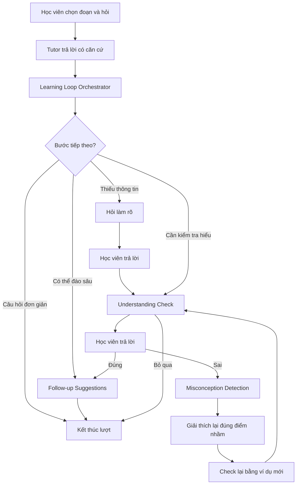
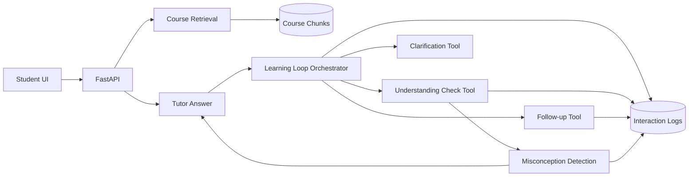

# VLearn Learning Loop

## 1. Tổng quan dự án

**VLearn Learning Loop** là một tính năng mở rộng cho VLearn AI Tutor, được thiết kế để biến trải nghiệm hỏi–đáp một chiều thành một vòng học tập có tương tác.

Thay vì chỉ trả lời câu hỏi rồi kết thúc, hệ thống phân tích câu hỏi và ngữ cảnh hiện tại để quyết định bước hỗ trợ tiếp theo phù hợp. Tùy từng trường hợp, tutor có thể:

- Kết thúc lượt nếu câu hỏi đơn giản và đã được trả lời đầy đủ.
- Hỏi làm rõ nếu câu hỏi thiếu thông tin hoặc có tham chiếu mơ hồ.
- Tạo một câu kiểm tra nhanh để xác nhận học viên đã hiểu đúng.
- Gợi ý các hướng đào sâu nếu học viên có thể tiếp tục khám phá nội dung.
- Phát hiện điểm hiểu nhầm khi học viên trả lời sai và giải thích lại đúng phần đang vướng.

Mục tiêu của dự án không phải làm cho học viên gửi nhiều tin nhắn hơn bằng mọi giá, mà là tăng số lượng **meaningful learning interactions**: mỗi tương tác tiếp theo phải giúp học viên kiểm tra mức hiểu, làm rõ điểm chưa chắc chắn hoặc đào sâu kiến thức.

---

## 2. Bối cảnh

VLearn là nền tảng học tập có AI Tutor hỗ trợ học viên trong lúc đọc tài liệu. Học viên có thể chọn một đoạn trên slide, gửi câu hỏi và nhận câu trả lời dựa trên nội dung khóa học.

Dữ liệu được cung cấp gồm:

- 1.261 lượt hỏi–đáp giữa học viên và tutor.
- 369 học viên.
- 585 hội thoại.
- Dữ liệu được thu thập trong giai đoạn 22/07–29/07/2026.

Qua EDA ban đầu, nhóm nhận thấy tutor hiện tại chủ yếu tập trung vào việc tạo ra một câu trả lời, nhưng chưa tận dụng các bước tương tác sau câu trả lời để kiểm tra và dẫn dắt quá trình học.

---

## 3. Insight từ dữ liệu

### 3.1 Tutor gần như chỉ sử dụng một hành vi sư phạm

Trong 1.261 lượt trả lời:

- `review_concept`: 1.072 lượt, tương đương khoảng 85%.
- `give_direct_answer`: 146 lượt.
- `give_example`: 21 lượt.
- `give_hint`: 4 lượt.
- `validate_understanding`: 1 lượt.

Phân phối này cho thấy tutor chủ yếu giải thích lại nội dung, trong khi các hành vi như đưa gợi ý, kiểm tra mức hiểu hoặc xử lý hiểu nhầm gần như chưa được sử dụng.

### 3.2 Gần như không có bước kiểm tra hiểu bài

- `asked_check_question=True`: chỉ 3 lượt.
- `follow_ups`: rỗng trong toàn bộ 1.261 lượt.
- `misconceptions`: rỗng trong toàn bộ 1.261 lượt.

Điều này cho thấy hệ thống hiện tại gần như chưa tạo được một vòng phản hồi để biết:

- Học viên đã hiểu đúng hay chưa.
- Học viên đang nhầm ở đâu.
- Tutor nên giải thích lại hay chuyển sang nội dung sâu hơn.
- Học viên nên hỏi gì tiếp theo.

### 3.3 Grounding vẫn là một ràng buộc quan trọng

Khoảng 46,2% câu trả lời có trường `citations` rỗng.

Dự án không chọn citation làm pain chính, nhưng coi grounding là một safety constraint bắt buộc: các bước kiểm tra hiểu, gợi ý follow-up và sửa hiểu nhầm chỉ nên được tạo khi câu trả lời ban đầu có đủ căn cứ từ tài liệu.

---

## 4. Painpoint

Trong lúc tự học từ tài liệu, sau khi nhận được lời giải thích, học viên không có một bước rõ ràng để kiểm tra mình đã hiểu đúng hay lựa chọn nội dung cần đào sâu tiếp.

Vì vậy, học viên phải tự quyết định tiếp tục thế nào dù chưa chắc đã nắm đúng kiến thức. Đồng thời, tutor không thu được đủ tín hiệu để điều chỉnh cách hỗ trợ ở lượt tiếp theo.

---

## 5. Problem Statement

> Trong quá trình tự học, học viên thường nhận được một lời giải thích nhưng chưa có đủ hỗ trợ để biết mình đã hiểu đúng, còn vướng ở đâu hoặc nên tìm hiểu tiếp điều gì. Vì thiếu các tín hiệu kiểm tra và gợi mở sau câu trả lời, nhiều tương tác dừng lại ở mức hỏi–đáp một chiều, các hiểu lầm khó được phát hiện và những lượt hỗ trợ tiếp theo thiếu căn cứ để thích ứng với nhu cầu thực tế của người học.

Problem statement này tập trung vào tình trạng hiện tại của người học và không giả định trước giải pháp công nghệ.

---

## 6. Job to be Done

### Job executor

Học viên đang đọc tài liệu trong buổi học và vừa hỏi tutor về một khái niệm chưa hiểu.

### Core job

Hiểu đúng một khái niệm trong tài liệu để có thể tiếp tục học phần tiếp theo.

### Desired outcome

Biết mình đã hiểu đúng hay vẫn còn nhầm, đồng thời xác định được bước học tiếp theo phù hợp.

---

## 7. Lát cắt sản phẩm

> Một học viên vừa nhận lời giải thích về một khái niệm · muốn xác định bước học tiếp theo để hiểu chắc hơn · hệ thống quyết định nên hỏi kiểm tra mức hiểu, gợi ý một câu hỏi đào sâu, hỏi làm rõ hay kết thúc lượt · trả về đúng một hành động tiếp theo phù hợp.

### Bốn thành phần của lát cắt

| Thành phần | Nội dung |
|---|---|
| Một người dùng | Học viên vừa nhận lời giải thích |
| Một công việc | Xác định bước học tiếp theo để hiểu chắc hơn |
| Một quyết định AI | Check understanding, suggest follow-up, ask clarification hoặc end turn |
| Một kết quả | Một hành động tiếp theo phù hợp với tình huống |

Quyết định AI trung tâm của sản phẩm là:

> **Sau câu trả lời hiện tại, tutor nên làm gì tiếp theo?**

---

## 8. Giải pháp đề xuất

Giải pháp là một **Learning Loop Orchestrator** đặt sau bước trả lời của tutor.

Orchestrator tự nhận diện một trong bốn trường hợp:

1. **Câu hỏi đơn giản**  
   Tutor trả lời ngắn gọn và kết thúc lượt.

2. **Thiếu thông tin**  
   Tutor hỏi làm rõ. Sau khi học viên bổ sung ngữ cảnh, flow chuyển sang Understanding Check.

3. **Cần kiểm tra hiểu**  
   Tutor tạo một micro-check để xác nhận học viên đã hiểu nội dung vừa giải thích.

4. **Có thể đào sâu**  
   Tutor gợi ý một số hướng follow-up liên quan trực tiếp đến nội dung hiện tại.

Nếu học viên trả lời Understanding Check sai, hệ thống gọi Misconception Detection để xác định điểm nhầm, giải thích lại đúng phần đó và kiểm tra bằng một ví dụ mới.

---

## 9. Workflow chính



Mọi nhánh đều có một điểm dừng rõ ràng là **Kết thúc lượt**.

---

## 10. Các module chính

### 10.1 Auto Router

Auto Router đọc câu hỏi và ngữ cảnh để phân loại:

```json
{
  "route": "check",
  "confidence": 0.84,
  "reason": "Câu hỏi liên quan đến khái niệm học tập và cần kiểm tra mức hiểu."
}
```

Các giá trị `route`:

```text
simple
clarify
check
deep
```

Trong prototype CP2, Auto Router sử dụng rule-based classification bằng JavaScript để đảm bảo demo ổn định.

Ở CP3, module này có thể được thay bằng một lời gọi LLM trả structured output mà không phải thay đổi flow giao diện.

### 10.2 Understanding Check

Tạo một câu hỏi ngắn dựa trên đúng nội dung tutor vừa giải thích.

Ví dụ:

```json
{
  "question": "Phát biểu nào mô tả đúng nhất vai trò của Value?",
  "type": "multiple_choice",
  "target_concept": "key_vs_value",
  "options": [
    "Value dùng để so khớp trực tiếp với Query",
    "Value chứa nội dung được tổng hợp theo trọng số attention",
    "Value tạo ra hàm softmax để chuẩn hóa điểm số"
  ],
  "correct_answer": 1
}
```

Understanding Check không phải một bài quiz dài. Nó chỉ tạo một tín hiệu nhanh để biết học viên đã hiểu hay chưa.

### 10.3 Follow-up Suggestions

Sinh tối đa 2–3 hướng học tiếp có liên quan trực tiếp tới câu hỏi và câu trả lời hiện tại.

Ví dụ:

```json
{
  "follow_ups": [
    {
      "label": "Hiểu cơ chế",
      "question": "Attention score được tính như thế nào?"
    },
    {
      "label": "Xem ví dụ",
      "question": "Xem ví dụ Q-K-V hoàn chỉnh"
    }
  ]
}
```

Học viên luôn có quyền bỏ qua hoặc kết thúc lượt.

### 10.4 Misconception Detection

Khi học viên trả lời sai, module xác định loại hiểu nhầm thay vì chỉ báo đúng/sai.

Ví dụ:

```json
{
  "result": "incorrect",
  "misconception": "confuses_key_with_value",
  "confidence": 0.87,
  "recommended_action": "contrast_with_concrete_example"
}
```

Tutor sau đó giải thích lại đúng phần đang nhầm và tạo một câu kiểm tra mới bằng ngữ cảnh khác.

---

## 11. Mức độ tự động hóa

Dự án sử dụng **Conditional Automation**.

Hệ thống tự thực hiện các bước khi:

- Câu hỏi đủ rõ.
- Có căn cứ từ tài liệu.
- Route có confidence đủ cao.
- Nội dung nằm trong phạm vi hỗ trợ.

Hệ thống hỏi làm rõ hoặc dừng khi:

- Câu hỏi có tham chiếu mơ hồ.
- Không có đủ nguồn.
- Không chắc về ý định người học.
- Nội dung nằm ngoài phạm vi tài liệu.

Lý do: ép học viên tương tác không đúng lúc có thể gây phiền, còn dẫn dắt sai có thể khiến học viên học sai kiến thức.

---

## 12. Trạng thái prototype CP2

Prototype hiện tại là một demo HTML/CSS/JavaScript chạy độc lập, không cần backend.

### Những phần đã có

- Giao diện mô phỏng VLearn document viewer.
- Chọn đoạn tài liệu và bấm `Hỏi Tutor`.
- Auto Router tự nhận diện bốn case.
- Hiển thị route, confidence và lý do.
- Flow hỏi làm rõ.
- Understanding Check.
- Nhánh trả lời đúng.
- Nhánh trả lời sai.
- Misconception Detection.
- Giải thích lại đúng điểm nhầm.
- Check lại bằng ví dụ mới.
- Follow-up Suggestions.
- Điểm dừng `Kết thúc lượt`.
- Reset để chạy lại demo.

### Câu hỏi mẫu cho bốn nhánh

| Case | Câu hỏi mẫu |
|---|---|
| Câu hỏi đơn giản | `Key là gì?` |
| Thiếu thông tin | `Cái này hoạt động như thế nào?` |
| Cần kiểm tra hiểu | `Key và Value khác nhau như thế nào?` |
| Có thể đào sâu | `Tại sao attention phải chia cho căn bậc hai của d_k?` |

---

## 13. Scope của MVP

### Trong phạm vi

- Một tài liệu bài học mẫu.
- Một flow hỏi–đáp theo ngữ cảnh.
- Bốn route chính.
- Một dạng Understanding Check.
- Một taxonomy misconception đơn giản.
- Follow-up Suggestions.
- Logging route và interaction.
- Demo end-to-end trong khoảng 5 phút.

### Ngoài phạm vi hiện tại

- Full learner profile dài hạn.
- Fine-tuning tutor generation model.
- Voice interaction.
- Full LMS integration.
- Teacher authoring dashboard.
- Knowledge tracing phức tạp.
- Hệ multi-agent tự do trao đổi không kiểm soát.
- Production authentication và payment.

---

## 14. Kiến trúc dự kiến cho CP3



### Tech stack dự kiến

- Frontend: Next.js hoặc HTML prototype trong giai đoạn đầu.
- Backend: FastAPI.
- Structured schema: Pydantic.
- Orchestration: LangGraph hoặc state machine nội bộ.
- LLM API: model hỗ trợ structured output và tool calling.
- Storage: PostgreSQL/Supabase.
- Retrieval: pgvector hoặc local vector store.
- Logging: PostgreSQL và/hoặc LangSmith.
- Deployment: Vercel cho frontend, Railway/Render cho backend.

---

## 15. Logging cần thu thập

Mỗi interaction nên ghi lại:

```json
{
  "question": "Key và Value khác nhau như thế nào?",
  "route": "check",
  "route_confidence": 0.84,
  "route_reason": "Câu hỏi khái niệm cần kiểm tra mức hiểu",
  "answer_grounded": true,
  "citation_ids": ["page_43"],
  "check_shown": true,
  "check_answered": true,
  "check_correct": false,
  "misconception_detected": "confuses_key_with_value",
  "follow_up_options_shown": 2,
  "follow_up_selected": null,
  "turn_ended": true
}
```

Logging giúp đánh giá hệ thống dựa trên hành vi thật thay vì chỉ nhìn output của LLM.

---

## 16. Metrics đề xuất

### Product metrics

- Follow-up continuation rate.
- Meaningful follow-up rate.
- Check participation rate.
- Interaction abandonment rate.
- User annoyance/skip rate.
- Average learning-loop depth.

### Learning metrics

- Check accuracy trước và sau khi giải thích lại.
- Misconception detection accuracy.
- Misconception resolution rate.
- Số bước cần thiết để học viên trả lời đúng.

### Safety và quality metrics

- Grounded answer rate.
- Citation correctness.
- Correct clarification rate.
- Correct route rate.
- Unsafe answer rate khi không có nguồn.
- End-to-end golden-set pass rate.

### System metrics

- Latency theo từng node.
- Số API calls mỗi lượt.
- Token usage.
- Chi phí trên mỗi learning loop.
- Tỷ lệ lỗi structured output.

---

## 17. Quality bar ban đầu

| Dimension | Quality bar |
|---|---:|
| Route accuracy | ≥ 80% |
| Clarification recall | ≥ 85% |
| Hard-case safe behavior | 100% |
| Grounded answer rate | ≥ 90% |
| Check-question relevance | ≥ 85% |
| Misconception detection | ≥ 75% |
| End-to-end golden-set pass | ≥ 80% |
| User có thể hoàn thành flow | 100% |

Quality bar phải được khóa trước khi chạy evaluation chính thức.

---

## 18. Giá trị khác biệt

VLearn Learning Loop không chỉ là một chatbot RAG có thêm vài câu hỏi gợi ý.

Khác biệt nằm ở việc hệ thống có một quyết định sư phạm rõ ràng sau mỗi câu trả lời:

> **Trả lời xong thì nên làm gì để giúp học viên học tiếp tốt hơn?**

Hệ thống tạo ra một vòng khép kín:

```text
Trả lời
→ kiểm tra hoặc gợi ý
→ quan sát phản hồi
→ phát hiện điểm nhầm
→ điều chỉnh cách giải thích
→ kết thúc hoặc đào sâu
```

Nhờ đó, VLearn có thể phát triển từ một công cụ trả lời câu hỏi thành một lớp hỗ trợ học tập thích ứng, có khả năng thu thập learning signals và cải thiện trải nghiệm theo thời gian.

---

## 19. Tầm nhìn phát triển

### Giai đoạn 1 — Learning Loop MVP

- Auto Router.
- Understanding Check.
- Follow-up Suggestions.
- Misconception Detection.
- Interaction logging.

### Giai đoạn 2 — Personalization

- Lưu mastery theo topic.
- Ghi nhận misconception lặp lại.
- Điều chỉnh độ khó và phong cách giải thích.
- Tạo review queue cá nhân.

### Giai đoạn 3 — Cohort Intelligence

- Tổng hợp knowledge gaps theo lớp.
- Phát hiện chủ đề nhiều học viên cùng mắc.
- Gợi ý nội dung bổ sung cho giảng viên.
- Đo tác động của tutor tới learning outcome.

---

## 20. Tóm tắt

VLearn Learning Loop giải quyết vấn đề tutor hiện tại chủ yếu trả lời một lần nhưng chưa tạo được bước tương tác tiếp theo để xác nhận, làm rõ hoặc đào sâu.

Giải pháp sử dụng một Learning Loop Orchestrator để tự động chọn giữa:

- Kết thúc lượt.
- Hỏi làm rõ.
- Kiểm tra mức hiểu.
- Gợi ý đào sâu.

Nếu học viên trả lời sai, hệ thống phát hiện hiểu nhầm, giải thích lại đúng điểm vướng và kiểm tra bằng một ví dụ mới.

Prototype CP2 hiện đã mô phỏng đầy đủ flow này bằng một demo HTML bấm được. Bước tiếp theo tại CP3 là thay Auto Router rule-based bằng một lời gọi AI thật, bổ sung structured tool calls và lưu interaction logs để evaluation.
