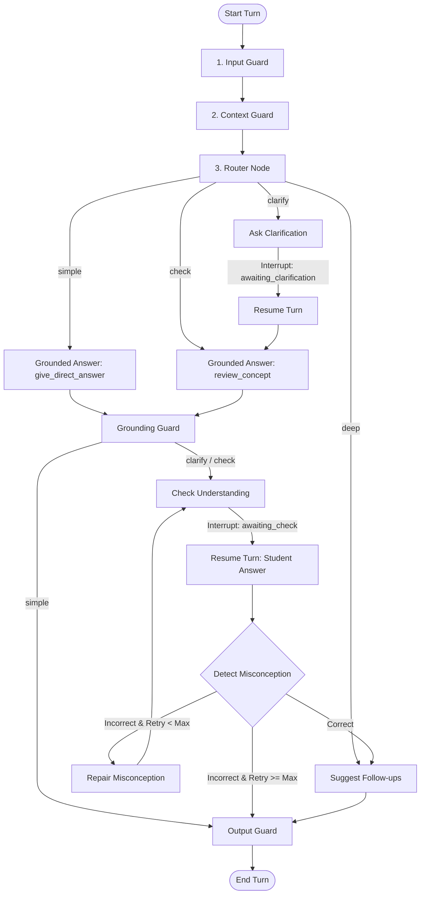

# VLearn AI Core (`vlearn_ai`)

`ai_core` is the Python package implementing the **VLearn Learning Loop Orchestrator**. It transforms one-way Q&A into an interactive, multi-step learning loop using LangGraph, OpenAI `gpt-5-nano` model, strict Pydantic schemas, and defense-in-depth guardrails.

---

## 1. Scope & Non-Scope

### Scope
- Fixed runtime model (`gpt-5-nano`).
- 4 workflow routes (`simple`, `clarify`, `check`, `deep`).
- 6 pedagogical tools (`review_concept`, `give_direct_answer`, `give_example`, `motivate`, `give_hint`, `validate_understanding`).
- LangGraph orchestration with interrupts and checkpointer state resume.
- Prompt injection defense in depth (heuristics, LLM assessment, context guard, plan guard allowlist, grounding guard, output guard).
- Deterministic unit and flow test suite.
- CLI interactive demo.

### Non-Scope
- FastAPI endpoints, frontend UI, authentication, database persistence, Docker/deployment (handled by backend/frontend teams).

---

## 2. Architecture & Learning Flow



---

## 3. Four Workflow Routes

| Route | Trigger Condition | Action |
|---|---|---|
| `simple` | Simple factual query (e.g., "Key là gì?") | Trả lời trực tiếp bằng `give_direct_answer`, kết thúc lượt. |
| `clarify` | Ngữ cảnh hoặc câu hỏi mơ hồ/thiếu thông tin | Hỏi làm rõ bằng `ask_clarification`, tạm dừng chờ học viên làm rõ. |
| `check` | Khái niệm cốt lõi cần kiểm tra mức hiểu | Giải thích khái niệm bằng `review_concept` + `give_example`, tạo micro-check và tạm dừng chờ học viên làm bài. |
| `deep` | Đã giải thích đủ hoặc câu hỏi đào sâu | Gợi ý 2-3 câu hỏi follow-up bằng `suggest_followups`, hoàn tất. |

---

## 4. Six Pedagogical Tools

1. `review_concept`: Giải thích khái niệm dựa trên ngữ cảnh bài học.
2. `give_direct_answer`: Trả lời trực tiếp, ngắn gọn câu hỏi tra cứu.
3. `give_example`: Tạo ví dụ cụ thể ánh xạ với khái niệm.
4. `give_hint`: Đưa ra gợi ý từng bước (hint) giúp học viên tự tư duy.
5. `motivate`: Khuyến khích, động viên ngắn gọn khi học viên trả lời sai nhiều lần.
6. `validate_understanding`: Hỗ trợ 2 chế độ:
   - `generate_check`: Tạo câu hỏi micro-check (MCQ / tự luận ngắn).
   - `evaluate_answer`: Đánh giá đáp án, phát hiện hiểu nhầm và đề xuất sửa nhầm.

---

## 5. Workflow Nodes vs Pedagogical Tools

- **Workflow Nodes** (`nodes.py`, `workflows/`): Quản lý luồng thực thi LangGraph (router, ask clarification, grounded answer, check understanding, misconception detection, repair misconception, suggest follow-ups, guardrails).
- **Pedagogical Tools** (`tools/`): 6 hành vi sư phạm nguyên tử được phép gọi theo quy tắc cho trước. Node `repair_misconception` điều phối các tool (`review_concept`, `give_example`, `give_hint`, `motivate`), còn node `check_understanding` gọi `validate_understanding`.

---

## 6. Guardrail Layers

1. **Input Guard**: Kết hợp Heuristics regex & LLM Prompt Injection Assessment.
2. **Context Guard**: Coi bài học là dữ liệu chưa kiểm duyệt, ngăn chặn prompt injection ẩn trong bài học.
3. **Plan Guard**: Giới hạn tối đa 4 bước tool và bắt buộc chỉ dùng 6 tool trong allowlist registry.
4. **Grounding Guard**: Xác minh trích dẫn/bằng chứng nằm trong tài liệu bài học.
5. **Output Guard**: Lọc bỏ API keys, prompt leaks, script tags và thông tin nội bộ.

---

## 7. Environment Setup & Usage

### 1. Requirements & Env
```bash
pip install -r ai_core/requirements.txt
cp ai_core/.env.example ai_core/.env
```

### 2. Running Quality Checks & Tests
```bash
python3 -m compileall ai_core
ruff check ai_core
pytest -v ai_core/tests
```

### 3. Optional Real Model Smoke Test (Requires OPENAI_API_KEY)
```bash
OPENAI_API_KEY="sk-..." pytest -v ai_core/tests/test_real_model.py
```

### 4. Running CLI Demo
```bash
python3 ai_core/examples/run_demo.py
```

---

## 8. Integration for Backend Team

```python
from vlearn_ai.interface import VLearnAICore

ai_core = VLearnAICore()

# Start new turn
result = await ai_core.start_turn(
    thread_id="session_123",
    question="Key và Value khác nhau như thế nào?",
    selected_context="Key dùng để so khớp với Query, Value chứa giá trị tổng hợp.",
)

# If status is 'awaiting_check' or 'awaiting_clarification', resume:
if result["status"] in ("awaiting_check", "awaiting_clarification"):
    result = await ai_core.resume_turn(
        thread_id="session_123",
        student_input="Lựa chọn A",
    )
```

---

## 9. Known Limitations

- Model được cố định là `gpt-5-nano` và không hỗ trợ chuyển đổi linh hoạt sang model khác tại runtime theo quy định dự án.
- Vòng lặp sửa lỗi hiểu nhầm được giới hạn tối đa `AI_MAX_RETRY_COUNT = 2` để tránh lặp vô tận.
