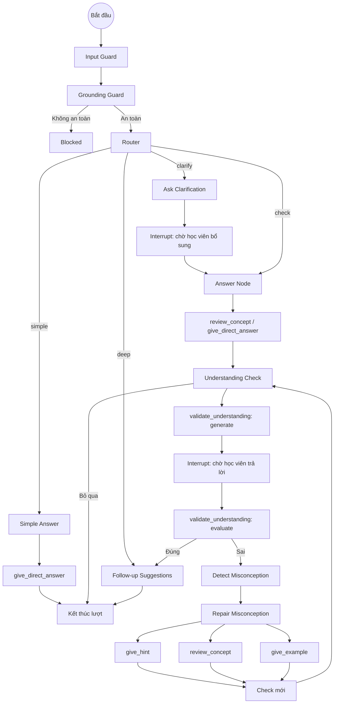
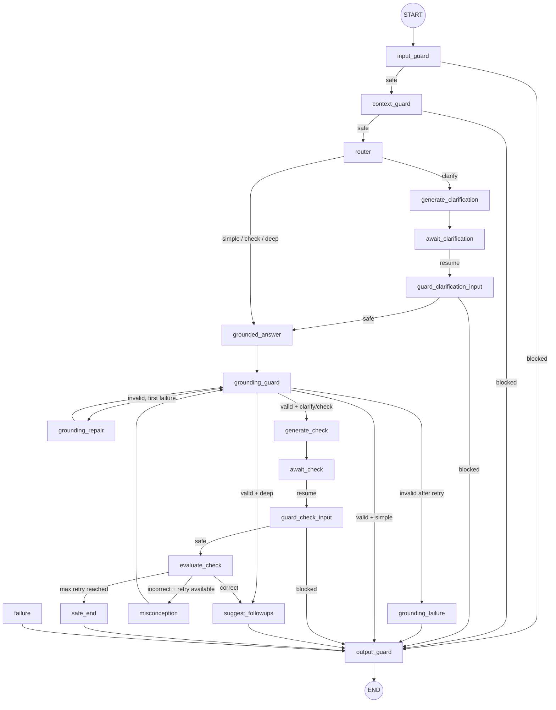

# VLearn LangGraph Flow

> Bản mô tả máy đọc được của [`langgraph_flow.png`](./langgraph_flow.png).
>
> Phạm vi: giải thích luồng điều phối học tập, các nhánh router, điểm
> interrupt và vòng lặp sửa misconception. Ảnh PNG là sơ đồ khái niệm;
> implementation hiện tại trong `vlearn_ai/graph/builder.py` và
> `vlearn_ai/graph/routes.py` là nguồn sự thật khi thực thi.

## 1. Mục tiêu của graph

Graph điều phối một lượt tương tác của VLearn Tutor theo trình tự:

1. Kiểm tra an toàn đầu vào.
2. Chọn chiến lược xử lý bằng router.
3. Trả lời trực tiếp, hỏi làm rõ hoặc kiểm tra mức độ hiểu.
4. Tạm dừng graph khi cần chờ học viên.
5. Đánh giá câu trả lời của học viên.
6. Nếu học viên hiểu sai, phát hiện và sửa misconception rồi kiểm tra lại.
7. Sinh câu hỏi gợi ý hoặc kết thúc lượt.

## 2. Sơ đồ khái niệm được chuyển từ PNG



## 3. Danh sách node trong ảnh

| Node | Vai trò |
|---|---|
| `Input Guard` | Kiểm tra input của người dùng trước khi đi vào luồng xử lý. |
| `Grounding Guard` | Xác định dữ liệu/câu trả lời có an toàn và có căn cứ hay không. |
| `Blocked` | Điểm dừng khi guard xác định yêu cầu không an toàn. |
| `Router` | Phân loại yêu cầu thành `simple`, `clarify`, `check` hoặc `deep`. |
| `Simple Answer` | Chuẩn bị luồng trả lời đơn giản. |
| `give_direct_answer` | Sinh câu trả lời trực tiếp, ngắn gọn. |
| `Ask Clarification` | Sinh câu hỏi yêu cầu học viên bổ sung thông tin. |
| `Interrupt: chờ học viên bổ sung` | Tạm dừng graph và chờ câu trả lời làm rõ. |
| `Answer Node` | Sinh câu trả lời có căn cứ sau khi đã đủ thông tin. |
| `review_concept / give_direct_answer` | Chọn công cụ sư phạm phù hợp để tạo câu trả lời. |
| `Understanding Check` | Quyết định hoặc bắt đầu bước kiểm tra mức độ hiểu. |
| `validate_understanding: generate` | Sinh câu hỏi kiểm tra. |
| `Interrupt: chờ học viên trả lời` | Tạm dừng graph và chờ đáp án của học viên. |
| `validate_understanding: evaluate` | Chấm và phân tích đáp án. |
| `Detect Misconception` | Xác định kiểu hiểu sai khi đáp án không đúng. |
| `Repair Misconception` | Lập kế hoạch sửa điểm hiểu sai. |
| `give_hint` | Đưa gợi ý từng bước. |
| `review_concept` | Ôn lại khái niệm liên quan. |
| `give_example` | Cung cấp ví dụ minh họa. |
| `Check mới` | Tạo vòng kiểm tra mới sau khi sửa misconception. |
| `Follow-up Suggestions` | Sinh các câu hỏi đào sâu tiếp theo. |
| `Kết thúc lượt` | Hoàn tất lượt tương tác hiện tại. |

## 4. Bảng chuyển trạng thái theo ảnh

| Từ | Điều kiện/nhãn | Đến |
|---|---|---|
| `Input Guard` | luôn luôn | `Grounding Guard` |
| `Grounding Guard` | không an toàn | `Blocked` |
| `Grounding Guard` | an toàn | `Router` |
| `Router` | `simple` | `Simple Answer` |
| `Simple Answer` | luôn luôn | `give_direct_answer` |
| `give_direct_answer` | hoàn tất | `Kết thúc lượt` |
| `Router` | `clarify` | `Ask Clarification` |
| `Ask Clarification` | đã tạo câu hỏi | `Interrupt: chờ học viên bổ sung` |
| `Interrupt: chờ học viên bổ sung` | được resume | `Answer Node` |
| `Router` | `check` | `Answer Node` |
| `Answer Node` | luôn luôn | `review_concept / give_direct_answer` |
| `review_concept / give_direct_answer` | hoàn tất | `Understanding Check` |
| `Router` | `deep` | `Follow-up Suggestions` |
| `Understanding Check` | tiếp tục kiểm tra | `validate_understanding: generate` |
| `Understanding Check` | bỏ qua | `Kết thúc lượt` |
| `validate_understanding: generate` | đã tạo câu hỏi | `Interrupt: chờ học viên trả lời` |
| `Interrupt: chờ học viên trả lời` | được resume | `validate_understanding: evaluate` |
| `validate_understanding: evaluate` | đúng | `Follow-up Suggestions` |
| `validate_understanding: evaluate` | sai | `Detect Misconception` |
| `Detect Misconception` | luôn luôn | `Repair Misconception` |
| `Repair Misconception` | tool được lập kế hoạch | `give_hint`, `review_concept`, `give_example` |
| Tool sửa misconception | hoàn tất | `Check mới` |
| `Check mới` | luôn luôn | `Understanding Check` |
| `Follow-up Suggestions` | hoàn tất | `Kết thúc lượt` |

## 5. Ý nghĩa các nhánh router

### `simple`

- Dành cho câu hỏi đơn giản, đủ ngữ cảnh.
- Graph tạo câu trả lời trực tiếp.
- Không bắt buộc tạo understanding check.
- Kết thúc lượt ngay sau câu trả lời.

### `clarify`

- Dành cho yêu cầu mơ hồ hoặc thiếu dữ kiện.
- Graph sinh câu hỏi làm rõ rồi interrupt.
- Khi học viên bổ sung thông tin, graph resume và đi tiếp đến answer node.

### `check`

- Dành cho tình huống cần trả lời và kiểm tra mức độ hiểu.
- Graph tạo câu trả lời có căn cứ.
- Sau đó sinh câu hỏi kiểm tra, interrupt và chờ đáp án.

### `deep`

- Dành cho yêu cầu đào sâu.
- Theo mũi tên thể hiện trong PNG, nhánh này đi đến `Follow-up Suggestions`.
- Trong implementation hiện tại, câu trả lời grounded được tạo trước khi sinh
  follow-up; xem mục 8 để biết luồng runtime chính xác.

## 6. Interrupt và resume

Graph có hai điểm chờ người dùng:

### Chờ bổ sung thông tin

```text
Ask Clarification
  -> interrupt(awaiting_clarification)
  -> học viên bổ sung dữ liệu
  -> resume
  -> guard input bổ sung
  -> tạo câu trả lời
```

### Chờ trả lời understanding check

```text
Generate Check
  -> interrupt(awaiting_check)
  -> học viên chọn/nhập đáp án
  -> resume
  -> guard đáp án
  -> evaluate
```

Khi resume, caller phải sử dụng đúng `thread_id` để LangGraph lấy lại
checkpoint của phiên đang chờ. Không được khởi tạo một graph state độc lập cho
câu trả lời bổ sung.

## 7. Vòng lặp misconception

```text
Đáp án sai
  -> Detect Misconception
  -> Repair Misconception
  -> chạy một hoặc nhiều tool:
       - review_concept
       - give_example
       - give_hint
  -> tạo check mới
  -> chờ học viên trả lời
  -> đánh giá lại
```

Vòng lặp kết thúc khi:

- học viên trả lời đúng;
- học viên bỏ qua;
- đạt giới hạn retry;
- guard chặn input/output;
- hoặc một node chuyển sang trạng thái lỗi.

## 8. Ánh xạ sang implementation hiện tại

Implementation đã chi tiết hóa một số node trong PNG.

| Khái niệm trong PNG | Node/code hiện tại |
|---|---|
| `Input Guard` | `input_guard` |
| Guard ngữ cảnh đầu vào | `context_guard` |
| `Router` | `router` |
| `Ask Clarification` | `generate_clarification` |
| Chờ học viên bổ sung | `await_clarification` |
| Guard dữ liệu bổ sung | `guard_clarification_input` |
| `Answer Node` và tool trả lời | `grounded_answer` |
| `Grounding Guard` | `grounding_guard` |
| Sửa lỗi grounding | `grounding_repair` |
| Grounding thất bại | `grounding_failure` |
| `validate_understanding: generate` | `generate_check` |
| Chờ đáp án | `await_check` |
| Guard đáp án | `guard_check_input` |
| `validate_understanding: evaluate` | `evaluate_check` |
| Detect + Repair Misconception | `misconception` |
| Kết thúc an toàn khi hết retry | `safe_end` |
| `Follow-up Suggestions` | `suggest_followups` |
| Chuẩn hóa output cuối | `output_guard` |
| Lỗi node | `failure` |

### Luồng runtime hiện tại



Các node lỗi có thể được wrapper chuyển đến `failure`, sau đó luôn đi qua
`output_guard` trước khi kết thúc.

## 9. State tối thiểu agent cần hiểu

Các nhóm trường chính trong `LearningLoopState`:

| Nhóm | Trường tiêu biểu |
|---|---|
| Định danh phiên | `thread_id` |
| Input | `user_query`, `selected_context`, `conversation_history` |
| Guard | `context_injection_detected`, `grounding_valid`, `grounding_retry_count` |
| Router | `route`, `route_confidence`, `route_reason` |
| Clarification | `clarification_question`, `clarification_answer` |
| Answer | `grounded_answer`, `grounded_claims`, `citations` |
| Understanding check | `check_question`, `student_check_answer`, `check_result` |
| Misconception | `misconception`, `repair_plan`, `retry_count` |
| Output phụ | `followups`, `tool_trace` |
| Lifecycle | `status`, `blocked_reason`, `failure_code`, `final_output` |

Các giá trị `status`:

- `running`
- `awaiting_clarification`
- `awaiting_check`
- `completed`
- `blocked`
- `failed`

## 10. Quy tắc dành cho agent đọc tài liệu này

1. Dùng sơ đồ PNG/Markdown để hiểu ý đồ sản phẩm và vòng lặp sư phạm.
2. Dùng `vlearn_ai/graph/builder.py` để xác định node và edge đang chạy thật.
3. Dùng `vlearn_ai/graph/routes.py` để xác định điều kiện rẽ nhánh.
4. Không bỏ qua guard khi resume từ interrupt.
5. Không tự tạo edge không tồn tại trong builder.
6. Mọi đường kết thúc runtime phải đi qua `output_guard`.
7. Vòng sửa misconception phải tôn trọng giới hạn `AI_MAX_RETRY_COUNT`.
8. Câu trả lời sau repair phải được kiểm tra grounding trước khi tạo check mới.

