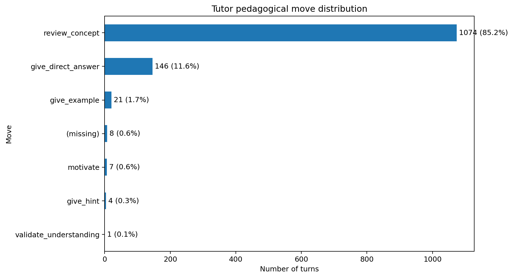
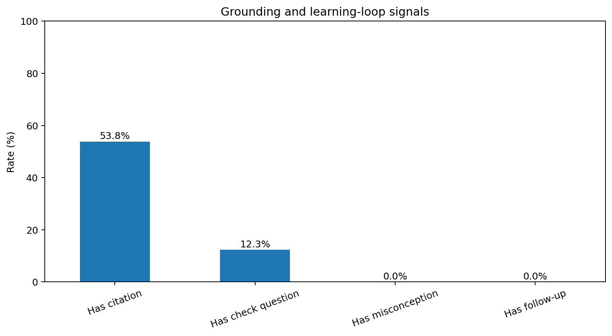
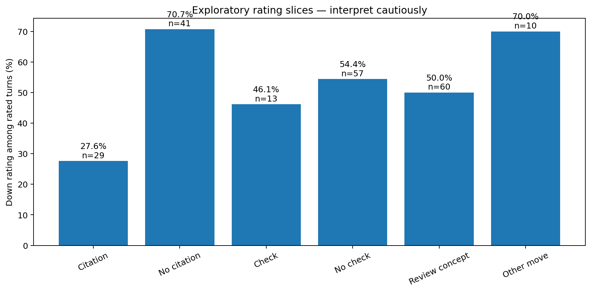
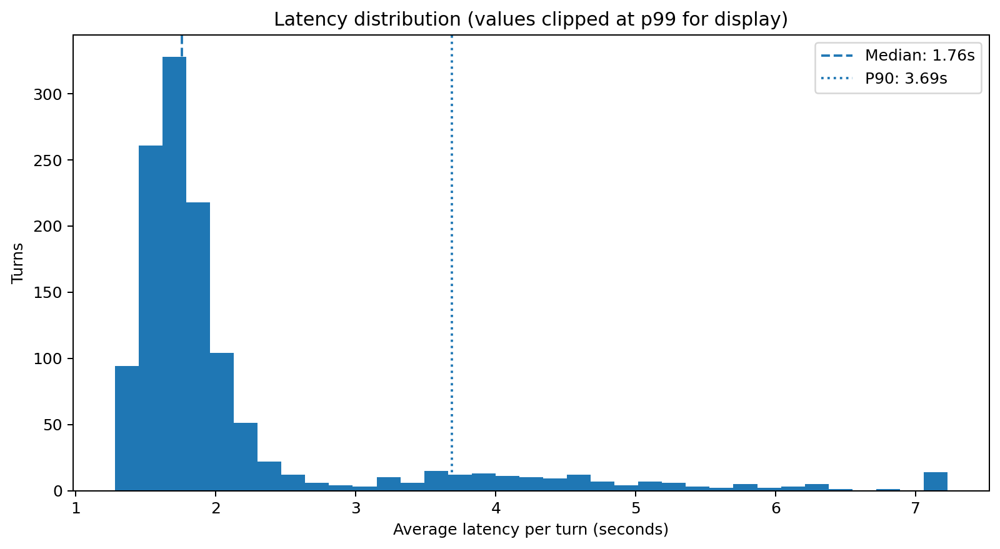
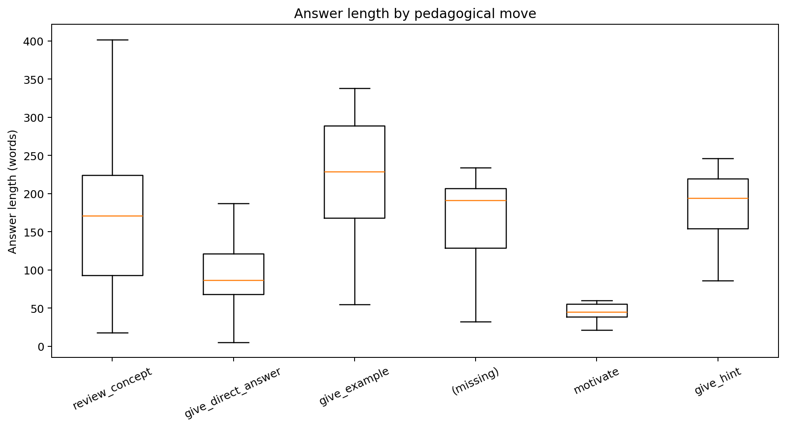

# VLearn Chatlog — EDA & Product Insight Report

> Báo cáo được tạo tự động từ dữ liệu local. Các heuristic chỉ dùng để tìm mẫu và
> hình thành giả thuyết; trước khi chốt evidence, nhóm cần review thủ công các ví dụ
> trong `annotation_sample.csv` và giữ tối thiểu 5 trích dẫn nguyên văn cho pain chính.

## 1. Dataset overview

| Metric | Value |
|---|---:|
| Complete student–tutor turns | 1,261 |
| Anonymous users | 369 |
| Conversations | 585 |
| Multi-turn conversations | 276 (47.2%) |
| Mean turns per user | 3.42 |
| Mean turns per conversation | 2.16 |
| Time range | 2026-07-22 11:00:41.960055+00:00 → 2026-07-29 17:01:20.065438+00:00 |

## 2. Data quality

| Check | Value |
|---|---:|
| Raw rows | 2,522 |
| Complete turn pairs | 1,261 |
| Incomplete/duplicate turns excluded | 0 |
| Duplicate message IDs | 0 |
| Duplicate `(turn_id, role)` rows | 0 |

## 3. Main descriptive findings

### 3.1 Tutor pedagogical moves

| move | count | rate_pct |
|---|---|---|
| review_concept | 1074 | 85.17 |
| give_direct_answer | 146 | 11.58 |
| give_example | 21 | 1.67 |
| (missing) | 8 | 0.63 |
| motivate | 7 | 0.56 |
| give_hint | 4 | 0.32 |
| validate_understanding | 1 | 0.08 |

**Observable finding:** `review_concept` chiếm **85.17%**
(1,074/1,261) số turn. Có
**526** lượt mà `review_concept` xuất hiện
liên tiếp sau một `review_concept` khác trong cùng conversation.

Điều này chưa tự động chứng minh chất lượng kém, nhưng cho thấy policy hiện tại có
độ đa dạng thấp và tạo ra một giả thuyết cần kiểm tra: khi học viên hỏi tiếp, tutor
có thực sự đổi cách dạy hay chỉ tiếp tục giải thích lại?

### 3.2 Learning-loop signals

| Signal | Count | Rate |
|---|---:|---:|
| Detected comprehension check | 155 | 12.29% |
| `asked_check_question=True` | 3 | 0.24% |
| Non-empty misconception | 0 | 0.00% |
| Non-empty follow-up | 0 | 0.00% |

**Observable finding:** hệ thống tạo câu trả lời nhưng thu được rất ít structured
signal về việc học viên hiểu đúng, hiểu sai hoặc nên học gì tiếp. Đây là evidence
mạnh cho **khoảng trống learning loop**, nhưng tác động lên người học vẫn cần được
xác nhận bằng survey/phỏng vấn.

### 3.3 Grounding and trust

| Signal | Count | Rate |
|---|---:|---:|
| Responses with citation | 679 | 53.85% |
| Responses without citation | 582 | 46.15% |

Citation rỗng không đồng nghĩa chắc chắn với hallucination. Một số câu hỏi thao tác
UI hoặc ngoài phạm vi không cần citation. Do đó cần annotation riêng các câu hỏi
kiến thức trước khi tuyên bố tỷ lệ “ungrounded answer”.

### 3.4 Feedback coverage

| Signal | Value |
|---|---:|
| Rated turns | 70 (5.55%) |
| Up ratings | 33 |
| Down ratings | 37 |
| Down among rated turns | 52.86% |

Rating coverage thấp nên không dùng để kết luận causal. Down-rated turns nên được
ưu tiên làm qualitative evidence và golden-set candidates.

### 3.5 Latency, calls and output length

| Metric | Value |
|---|---:|
| Median latency | 1758.0 ms |
| P90 latency | 3686.0 ms |
| P95 latency | 4650.0 ms |
| Maximum latency | 23848.0 ms |
| Mean LLM calls per turn | 3.15 |
| Median answer length | 158.0 words |
| P90 answer length | 268.0 words |

## 4. Pain candidates — impact table from observed data

| Pain candidate | Turns | Users | Conversations | Definition |
|---|---|---|---|---|
| Tutor trả lời nhưng chưa đóng vòng kiểm tra hiểu bài | 1106/1261 (87.7%) | 350/369 (94.8%) | 544/585 (93.0%) | Turn không có asked_check_question=True, không khớp mẫu hỏi kiểm tra và không kết thúc bằng câu hỏi. |
| Hành vi sư phạm tập trung quá mạnh vào giải thích lại | 1074/1261 (85.2%) | 326/369 (88.3%) | 524/585 (89.6%) | move_used = review_concept. |
| Tutor tiếp tục dùng review_concept ở các lượt liên tiếp | 526/1261 (41.7%) | 170/369 (46.1%) | 228/585 (39.0%) | Trong cùng conversation, lượt hiện tại và lượt trước đều có move_used=review_concept. |
| Câu trả lời không có citation để học viên kiểm chứng | 582/1261 (46.1%) | 255/369 (69.1%) | 339/585 (58.0%) | citations rỗng hoặc không parse được thành danh sách có phần tử. |
| Một nhóm lượt phản hồi có latency cao | 127/1261 (10.1%) | 82/369 (22.2%) | 93/585 (15.9%) | avg_latency_ms nằm trong 10% cao nhất của dataset. |

### Recommended ordering

1. **Learning loop and strategy adaptation** — chọn làm pain chính nếu manual review
   xác nhận nhiều conversation mà học viên hỏi lại nhưng tutor không đổi cách hỗ trợ.
2. **Grounding/citation** — giữ làm safety and trust constraint, đồng thời kiểm tra
   riêng trên các câu hỏi kiến thức.
3. **Latency** — pain kỹ thuật có thật nhưng chưa có bằng chứng cho thấy là trở ngại
   học tập lớn nhất.

## 5. Product insight chain

### Data observation

- Phần lớn lượt được gắn cùng một pedagogical move.
- Comprehension checks, misconception records và follow-ups xuất hiện rất ít.
- Một phần đáng kể output không có citation.

### Product hypothesis

Tutor hiện tại tối ưu cho việc **tạo ra câu trả lời cho từng lượt**, nhưng chưa tối ưu
cho việc **nhận biết học viên đã hiểu đến đâu và thay đổi chiến lược ở lượt tiếp theo**.

### User pain to validate

> Học viên đang cố hiểu một khái niệm nhận được lời giải thích, nhưng không biết mình
> đã hiểu đúng hay chưa; khi vẫn chưa hiểu, lượt hỗ trợ tiếp theo có thể tiếp tục cùng
> một kiểu giải thích thay vì xử lý đúng điểm mắc.

### Problem statement draft — không chứa solution

> Học viên đang tự học từ tài liệu thường không biết liệu mình đã hiểu đúng một khái
> niệm sau khi được giải thích hay chưa. Những điểm hiểu sai không được nhận diện,
> khiến các lượt hỗ trợ tiếp theo thiếu căn cứ để điều chỉnh theo khó khăn thực tế của
> từng người.

### Prototype slice draft

> Với một học viên đang hỏi về một khái niệm trong tài liệu, hệ thống quyết định nước
> đi sư phạm tiếp theo dựa trên nguồn học và tín hiệu hiểu bài hiện có, để tạo một phản
> hồi giúp phát hiện hoặc xử lý điểm học viên chưa hiểu.

## 6. Evidence examples

### Tutor trả lời nhưng chưa đóng vòng kiểm tra hiểu bài

| turn_id | question | answer | move_used | rating |
|---|---|---|---|---|
| T0317 | Hiện tại cách thức tiếp cận nghiên cứu AI bao gồm | Dựa trên nội dung tài liệu hiện có, thông tin cụ thể về các "cách thức tiếp cận nghiên cứu AI" tại trang 11 không được hiển thị đầy đủ trong phần trích xuất slide. Tuy nhiên, nếu bạn đang đề cập đến các xu hướng nghiên cứu hoặc phương pháp luận trong AI (như… | review_concept | down |
| T0466 | giải thích chi tiết hơn slide 26 | Xin lỗi bạn, vì hệ thống slide hiện tại không có dữ liệu cho "slide 26" nên tôi không thể giải thích nội dung cụ thể đó cho bạn được. Bạn có thể cho tôi biết tiêu đề hoặc nội dung chính của slide đó không? Tôi sẽ tra cứu lại dựa trên từ khóa đó để hỗ trợ bạn. | review_concept | down |
| T0012 | Giải thích đoạn bôi đen ở Trang 24. | "Decomposition" (phân tách nhiệm vụ) là một kỹ thuật được sử dụng khi task của bạn quá phức tạp để mô hình có thể giải quyết tốt trong một lần thử duy nhất [trang 24]. Thay vì yêu cầu mô hình thực hiện toàn bộ quy trình ngay lập tức, bạn chia nhỏ công việc th… | review_concept | unrated |
| T0280 | tóm tắt toàn bộ slide | Chào bạn, hiện tại tôi không thể tóm tắt nội dung vì hệ thống không tìm thấy dữ liệu slide tương ứng với từ khóa "tóm tắt toàn bộ slide". Bạn có thể cung cấp tên chủ đề hoặc khái niệm cụ thể mà bạn đang muốn tìm hiểu trong bài học ngày hôm nay không? Tôi sẽ h… | review_concept | unrated |
| T1021 | giải thích tôi cả slide này Giải thích đoạn bôi đen ở Trang 6: "Sản phẩm AI" | Tại trang 6, khái niệm "Sản phẩm AI" (AI Product) được định nghĩa với các ý chính sau: - **Tính kế thừa:** Sản phẩm tích hợp AI bản chất vẫn là một sản phẩm hoàn chỉnh, tuân thủ các nguyên lý phát triển sản phẩm truyền thống, không thay thế hoàn toàn các nguy… | review_concept | unrated |

### Hành vi sư phạm tập trung quá mạnh vào giải thích lại

| turn_id | question | answer | move_used | rating |
|---|---|---|---|---|
| T0317 | Hiện tại cách thức tiếp cận nghiên cứu AI bao gồm | Dựa trên nội dung tài liệu hiện có, thông tin cụ thể về các "cách thức tiếp cận nghiên cứu AI" tại trang 11 không được hiển thị đầy đủ trong phần trích xuất slide. Tuy nhiên, nếu bạn đang đề cập đến các xu hướng nghiên cứu hoặc phương pháp luận trong AI (như… | review_concept | down |
| T0466 | giải thích chi tiết hơn slide 26 | Xin lỗi bạn, vì hệ thống slide hiện tại không có dữ liệu cho "slide 26" nên tôi không thể giải thích nội dung cụ thể đó cho bạn được. Bạn có thể cho tôi biết tiêu đề hoặc nội dung chính của slide đó không? Tôi sẽ tra cứu lại dựa trên từ khóa đó để hỗ trợ bạn. | review_concept | down |
| T0327 | hi | Chào bạn, tôi là gia sư AI của bạn. Rất vui được hỗ trợ bạn trong ngày học hôm nay. Tôi có thể giúp gì cho bạn về nội dung bài học không? | review_concept | unrated |
| T1070 | thế có cái gì là agent chuẩn | Trong tài liệu của bài học này, không có định nghĩa cụ thể cho một "agent chuẩn". Tuy nhiên, một hệ thống được coi là Agent khi nó có khả năng tự chủ cao hơn một chatbot thông thường. Thông thường, một Agent sẽ bao gồm các đặc tính cốt lõi sau: * **Perception… | review_concept | unrated |
| T0776 | giải thích và tóm tắt nội dung học hôm này | Xin lỗi bạn, tôi không tìm thấy phần tóm tắt tổng quát trong nội dung bài giảng của ngày hôm nay. Bạn có thể cho tôi biết cụ thể chủ đề hoặc khái niệm mà bạn muốn tôi giải thích không? Tôi sẽ dựa vào tài liệu bài giảng để hỗ trợ bạn một cách chính xác nhất. | review_concept | down |

### Tutor tiếp tục dùng review_concept ở các lượt liên tiếp

| turn_id | question | answer | move_used | rating |
|---|---|---|---|---|
| T0317 | Hiện tại cách thức tiếp cận nghiên cứu AI bao gồm | Dựa trên nội dung tài liệu hiện có, thông tin cụ thể về các "cách thức tiếp cận nghiên cứu AI" tại trang 11 không được hiển thị đầy đủ trong phần trích xuất slide. Tuy nhiên, nếu bạn đang đề cập đến các xu hướng nghiên cứu hoặc phương pháp luận trong AI (như… | review_concept | down |
| T0466 | giải thích chi tiết hơn slide 26 | Xin lỗi bạn, vì hệ thống slide hiện tại không có dữ liệu cho "slide 26" nên tôi không thể giải thích nội dung cụ thể đó cho bạn được. Bạn có thể cho tôi biết tiêu đề hoặc nội dung chính của slide đó không? Tôi sẽ tra cứu lại dựa trên từ khóa đó để hỗ trợ bạn. | review_concept | down |
| T0962 | Giải thích đoạn bôi đen ở Trang 4. | Đoạn này nhấn mạnh việc sử dụng **Agentic Fit Framework** làm công cụ ra quyết định kỹ thuật. Thay vì mặc định xây dựng một hệ thống Agent phức tạp, bạn cần đánh giá bài toán của mình dựa trên 4 tiêu chí cụ thể để xác định liệu việc "nâng cấp" từ Chatbot thôn… | review_concept | unrated |
| T1137 | Giải thích đoạn bôi đen ở Trang 18. | Deep Learning và Machine Learning truyền thống có những điểm khác biệt cơ bản trong cách xử lý dữ liệu và xây dựng mô hình: * **Tính năng (Feature Engineering):** Trong Machine Learning truyền thống, con người cần can thiệp để xác định và chọn lọc các đặc trư… | review_concept | unrated |
| T0812 | giải thích slide trang 26 | Xin lỗi bạn, tôi không tìm thấy nội dung nào tại trang 26 trong tài liệu của bài học này. Bạn có thể kiểm tra lại số trang hoặc cung cấp thêm thông tin về nội dung bạn muốn tìm hiểu không? Tôi sẽ rất sẵn lòng hỗ trợ bạn giải thích các khái niệm trong bài học. | review_concept | unrated |

### Câu trả lời không có citation để học viên kiểm chứng

| turn_id | question | answer | move_used | rating |
|---|---|---|---|---|
| T0317 | Hiện tại cách thức tiếp cận nghiên cứu AI bao gồm | Dựa trên nội dung tài liệu hiện có, thông tin cụ thể về các "cách thức tiếp cận nghiên cứu AI" tại trang 11 không được hiển thị đầy đủ trong phần trích xuất slide. Tuy nhiên, nếu bạn đang đề cập đến các xu hướng nghiên cứu hoặc phương pháp luận trong AI (như… | review_concept | down |
| T0466 | giải thích chi tiết hơn slide 26 | Xin lỗi bạn, vì hệ thống slide hiện tại không có dữ liệu cho "slide 26" nên tôi không thể giải thích nội dung cụ thể đó cho bạn được. Bạn có thể cho tôi biết tiêu đề hoặc nội dung chính của slide đó không? Tôi sẽ tra cứu lại dựa trên từ khóa đó để hỗ trợ bạn. | review_concept | down |
| T0541 | Giúp tôi viết summary chi tiết và đầy đủ nhất về toàn bộ slide bài giảng ngày hôm nay | Rất tiếc, hiện tại trong nội dung slide bài giảng của ngày hôm nay không chứa thông tin chi tiết về khái niệm "ReAct Design Pattern" hay một bản tóm tắt tổng quát về toàn bộ các slide. Để tôi có thể hỗ trợ bạn hiệu quả nhất, bạn có thể chia sẻ cụ thể hơn về c… | review_concept | unrated |
| T1052 | cách tải xuống file | Rất xin lỗi bạn, trong tài liệu của bài học hôm nay không đề cập đến hướng dẫn chi tiết về cách tải xuống file. Nếu đây là một thao tác cụ thể trong công cụ hoặc giao diện bạn đang sử dụng cho bài tập thực hành, bạn có thể kiểm tra các nút chức năng (thường l… | review_concept | unrated |
| T0072 | Which model do the tutor like you pretrain on ? Qwen or mistral ? | Tôi không có thông tin về model cụ thể nào đã được dùng để huấn luyện chính mình. Tôi là một hệ thống AI được thiết kế để hỗ trợ học tập dựa trên nội dung bài giảng của khóa học, hoạt động theo các quy định và chính sách đã được thiết lập. Các thông tin về ki… | review_concept | unrated |

### Một nhóm lượt phản hồi có latency cao

| turn_id | question | answer | move_used | rating |
|---|---|---|---|---|
| T1258 | tóm tắt slide này | Rất tiếc là tôi đã tra cứu trong tài liệu nhưng chưa tìm thấy nội dung cụ thể của **Trang 33**. Kết quả tìm kiếm chỉ hiển thị các trang khác có nhắc đến con số "33" (như mức điểm 33% trong các bài kiểm tra đánh giá AI trên trang 60 và 72). Bạn có thể cho tôi… | give_direct_answer | down |
| T0795 | slide 9 là gì | Rất tiếc là mình đã thử tra cứu nhưng chưa tìm thấy nội dung cụ thể được đánh dấu là "slide 9" trong tài liệu hiện tại. Bạn có thể chia sẻ thêm tiêu đề của slide đó hoặc một từ khóa/nội dung chính xuất hiện trên slide 9 để mình có thể hỗ trợ bạn giải thích ch… | give_direct_answer | down |
| T1188 | cấu trúc bên trong 1 con chatbot | Cấu trúc bên trong của một con chatbot được vận hành dựa trên công thức cốt lõi: **Chatbot = Vòng lặp + Trí nhớ** [trang 78]. Cụ thể, cấu trúc này bao gồm các thành phần chính sau: 1. **Trí nhớ (History):** Bản thân các mô hình ngôn ngữ (LLM) là **stateless**… | review_concept | unrated |
| T0978 | bạn được tạo ra từ LLM nào | Tôi là một mô hình ngôn ngữ lớn, được huấn luyện bởi Google. Dựa trên nội dung bài học, bạn có thể hiểu thêm rằng các mô hình ngôn ngữ lớn (LLM) như tôi được tạo ra thông qua một quy trình gồm nhiều giai đoạn [trang 38]: 1. **Pre-training (Tiền huấn luyện):**… | give_direct_answer | unrated |
| T0201 | tôi muốn biết nhiều thông tin hơn về người này | Dựa trên thông tin từ slide bài giảng, đây là các thông tin chi tiết về giảng viên **Mai Anh Nguyen (Blue)**: * **Vai trò hiện tại:** Giảng viên khóa học "AI IN ACTION - Day 1" với chủ đề "AI & LLM Foundation" [trang 1]. Ngoài ra, cô còn được biết đến là một… | give_direct_answer | unrated |

## 7. Manual review protocol

Review `annotation_sample.csv` bằng hai người độc lập. Với mỗi turn, đánh dấu:

1. Câu hỏi thuộc intent nào?
2. Tutor có trả lời đúng intent và đúng kiến thức không?
3. Citation có thực sự support claim không?
4. Tutor có sử dụng context/lịch sử học viên không?
5. Nếu đây là lượt hỏi tiếp, tutor có đổi chiến lược không?
6. Có cần kiểm tra hiểu bài hoặc phát hiện misconception không?
7. Pedagogical move tốt nhất đáng lẽ là gì?

Chỉ dùng một pain làm evidence cuối khi có:

- số đếm và quy tắc đếm kiểm lại được;
- số user/conversation bị ảnh hưởng;
- ít nhất 5 ví dụ nguyên văn;
- manual agreement đủ tốt giữa hai annotator;
- survey xác nhận hậu quả mà data log chưa đo trực tiếp.

## 8. Files generated

- `turn_level_analysis.csv`: một dòng/cặp hỏi-đáp với toàn bộ feature heuristic.
- `conversation_level_analysis.csv`: signal thích ứng ở cấp hội thoại.
- `annotation_sample.csv`: mẫu review thủ công có sẵn cột điền nhãn.
- `evidence_examples.csv`: ví dụ nguyên văn theo từng pain candidate.
- `metrics.json`: số liệu máy đọc được.
- `CP1_DRAFT.md`: Canvas nháp để gặp TA.
